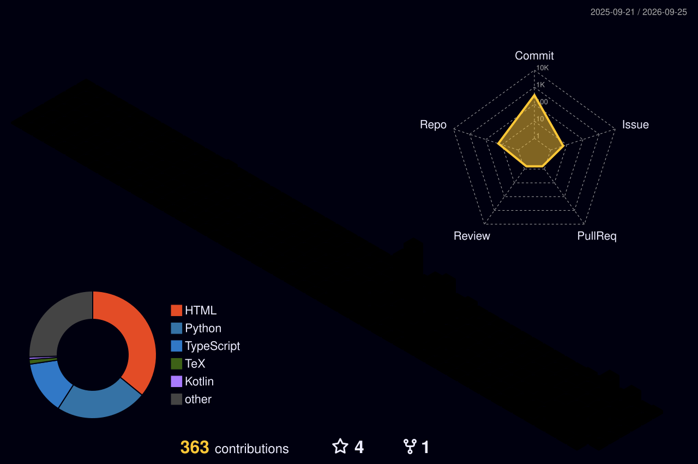

<!-- 顶部打字动画 - 全宽居中 -->
<div align="center">
  <a href="https://git.io/typing-svg">
    
  </a>
</div>

<p align="center">
  <a href="https://space.bilibili.com/481036572"></a>&nbsp;&nbsp;
  <a href="https://www.xiaohongshu.com/user/profile/5e72db210000000001000d66"></a>&nbsp;&nbsp;
  &nbsp;&nbsp;
  <a href="https://wakatime.com/@SakuraLoveForever"></a>&nbsp;&nbsp;
  <a href="https://codeforces.com/profile/Sakura_Love">
    
  </a>&nbsp;&nbsp;
  <a href="https://www.luogu.com.cn/user/233253">
    
  </a>
</p>

<div align="center">
  <picture>
    <source media="(prefers-color-scheme: dark)" srcset="https://raw.githubusercontent.com/SakuraLoveForever/SakuraLoveForever/refs/heads/output/github-contribution-grid-snake-dark.svg">
    <source media="(prefers-color-scheme: light)" srcset="https://raw.githubusercontent.com/SakuraLoveForever/SakuraLoveForever/refs/heads/output/github-contribution-grid-snake.svg">
    
  </picture>
</div>

<!--START_SECTION:waka-->


**🐱 My GitHub Data** 

> 📦 602.3 kB Used in GitHub's Storage 
 > 
> 🏆 206 Contributions in the Year 2026
 > 
> 🚫 Not Opted to Hire
 > 
> 📜 11 Public Repositories 
 > 
> 🔑 0 Private Repositories 
 > 
**I'm a Night 🦉** 

```text
🌞 Morning                34 commits          ⬛⬛⬛⬛⬜⬜⬜⬜⬜⬜⬜⬜⬜⬜⬜⬜⬜⬜⬜⬜⬜⬜⬜⬜⬜   16.83 % 
🌆 Daytime                54 commits          ⬛⬛⬛⬛⬛⬛⬛⬜⬜⬜⬜⬜⬜⬜⬜⬜⬜⬜⬜⬜⬜⬜⬜⬜⬜   26.73 % 
🌃 Evening                61 commits          ⬛⬛⬛⬛⬛⬛⬛⬛⬜⬜⬜⬜⬜⬜⬜⬜⬜⬜⬜⬜⬜⬜⬜⬜⬜   30.20 % 
🌙 Night                  53 commits          ⬛⬛⬛⬛⬛⬛⬛⬜⬜⬜⬜⬜⬜⬜⬜⬜⬜⬜⬜⬜⬜⬜⬜⬜⬜   26.24 % 
```
📅 **I'm Most Productive on Monday** 

```text
Monday                   60 commits          ⬛⬛⬛⬛⬛⬛⬛⬜⬜⬜⬜⬜⬜⬜⬜⬜⬜⬜⬜⬜⬜⬜⬜⬜⬜   29.70 % 
Tuesday                  55 commits          ⬛⬛⬛⬛⬛⬛⬛⬜⬜⬜⬜⬜⬜⬜⬜⬜⬜⬜⬜⬜⬜⬜⬜⬜⬜   27.23 % 
Wednesday                21 commits          ⬛⬛⬛⬜⬜⬜⬜⬜⬜⬜⬜⬜⬜⬜⬜⬜⬜⬜⬜⬜⬜⬜⬜⬜⬜   10.40 % 
Thursday                 12 commits          ⬛⬜⬜⬜⬜⬜⬜⬜⬜⬜⬜⬜⬜⬜⬜⬜⬜⬜⬜⬜⬜⬜⬜⬜⬜   05.94 % 
Friday                   14 commits          ⬛⬛⬜⬜⬜⬜⬜⬜⬜⬜⬜⬜⬜⬜⬜⬜⬜⬜⬜⬜⬜⬜⬜⬜⬜   06.93 % 
Saturday                 32 commits          ⬛⬛⬛⬛⬜⬜⬜⬜⬜⬜⬜⬜⬜⬜⬜⬜⬜⬜⬜⬜⬜⬜⬜⬜⬜   15.84 % 
Sunday                   8 commits           ⬛⬜⬜⬜⬜⬜⬜⬜⬜⬜⬜⬜⬜⬜⬜⬜⬜⬜⬜⬜⬜⬜⬜⬜⬜   03.96 % 
```


📊 **This Week I Spent My Time On** 

```text
🕑︎ Time Zone: Asia/Shanghai

💬 Programming Languages: 
HTML                     7 hrs 54 mins       ⬛⬛⬛⬛⬛⬛⬛⬛⬛⬜⬜⬜⬜⬜⬜⬜⬜⬜⬜⬜⬜⬜⬜⬜⬜   34.55 % 
Python                   5 hrs 21 mins       ⬛⬛⬛⬛⬛⬛⬜⬜⬜⬜⬜⬜⬜⬜⬜⬜⬜⬜⬜⬜⬜⬜⬜⬜⬜   23.43 % 
JavaScript               3 hrs 25 mins       ⬛⬛⬛⬛⬜⬜⬜⬜⬜⬜⬜⬜⬜⬜⬜⬜⬜⬜⬜⬜⬜⬜⬜⬜⬜   14.98 % 
CSS                      2 hrs 49 mins       ⬛⬛⬛⬜⬜⬜⬜⬜⬜⬜⬜⬜⬜⬜⬜⬜⬜⬜⬜⬜⬜⬜⬜⬜⬜   12.35 % 
JSON                     56 mins             ⬛⬜⬜⬜⬜⬜⬜⬜⬜⬜⬜⬜⬜⬜⬜⬜⬜⬜⬜⬜⬜⬜⬜⬜⬜   04.10 % 

🔥 Editors: 
VS Code                  18 hrs 55 mins      ⬛⬛⬛⬛⬛⬛⬛⬛⬛⬛⬛⬛⬛⬛⬛⬛⬛⬛⬛⬛⬛⬜⬜⬜⬜   82.70 % 
Unknown Editor           2 hrs 21 mins       ⬛⬛⬛⬜⬜⬜⬜⬜⬜⬜⬜⬜⬜⬜⬜⬜⬜⬜⬜⬜⬜⬜⬜⬜⬜   10.29 % 
Claude Code              1 hr 36 mins        ⬛⬛⬜⬜⬜⬜⬜⬜⬜⬜⬜⬜⬜⬜⬜⬜⬜⬜⬜⬜⬜⬜⬜⬜⬜   07.01 % 

🐱‍💻 Projects: 
website_Sakura_Love      9 hrs 24 mins       ⬛⬛⬛⬛⬛⬛⬛⬛⬛⬛⬜⬜⬜⬜⬜⬜⬜⬜⬜⬜⬜⬜⬜⬜⬜   41.13 % 
Anime                    7 hrs 15 mins       ⬛⬛⬛⬛⬛⬛⬛⬛⬜⬜⬜⬜⬜⬜⬜⬜⬜⬜⬜⬜⬜⬜⬜⬜⬜   31.75 % 
PC_System_Auto_Scripts   6 hrs 7 mins        ⬛⬛⬛⬛⬛⬛⬛⬜⬜⬜⬜⬜⬜⬜⬜⬜⬜⬜⬜⬜⬜⬜⬜⬜⬜   26.74 % 
system32                 5 mins              ⬜⬜⬜⬜⬜⬜⬜⬜⬜⬜⬜⬜⬜⬜⬜⬜⬜⬜⬜⬜⬜⬜⬜⬜⬜   00.37 % 

💻 Operating System: 
Windows                  22 hrs 52 mins      ⬛⬛⬛⬛⬛⬛⬛⬛⬛⬛⬛⬛⬛⬛⬛⬛⬛⬛⬛⬛⬛⬛⬛⬛⬛   100.00 % 
```

**I Mostly Code in HTML** 

```text
HTML                     6 repos             ⬛⬛⬛⬛⬛⬛⬛⬛⬛⬛⬛⬛⬛⬛⬛⬛⬛⬜⬜⬜⬜⬜⬜⬜⬜   66.67 % 
TypeScript               1 repo              ⬛⬛⬛⬜⬜⬜⬜⬜⬜⬜⬜⬜⬜⬜⬜⬜⬜⬜⬜⬜⬜⬜⬜⬜⬜   11.11 % 
Python                   1 repo              ⬛⬛⬛⬜⬜⬜⬜⬜⬜⬜⬜⬜⬜⬜⬜⬜⬜⬜⬜⬜⬜⬜⬜⬜⬜   11.11 % 
Vue                      1 repo              ⬛⬛⬛⬜⬜⬜⬜⬜⬜⬜⬜⬜⬜⬜⬜⬜⬜⬜⬜⬜⬜⬜⬜⬜⬜   11.11 % 
```


 Last Updated on 25/05/2026 20:05:40 UTC
<!--END_SECTION:waka-->

<!-- 空行分隔 -->
<div>&nbsp;</div>

<div align="center">
  
</div>

<div align="center">
  <table>
    <tr>
      <td align="center">
        <a href="https://github.com/anuraghazra/github-readme-stats">
          
        </a>
      </a>
      <td align="center">
        <a href="https://git.io/streak-stats">
          
        </a>
      </a>
    </tr>
    <tr>
      <td align="center" width="50%">
        <a href="https://github.com/anuraghazra/github-readme-stats">
          
        </a>
      </a>
      <td align="center" width="50%">
        
      </a>
    </tr>
  </table>
</div>

<div>&nbsp;</div>

<div align="center">
  <a href="https://github.com/ashutosh00710/github-readme-activity-graph">
    
  </a>
</div>

<div>&nbsp;</div>

<div align="center">
  <table>
    <!-- 第 1 行（原第 3 行）：Issues/PRs 和 Reactions -->
    <tr>
      <td align="center">
        
      </td>
      <td align="center">
        
      </td>
    </tr>
    <!-- 第 2 行：语言统计 和 Star 仓库 -->
    <tr>
      <td align="center">
        
      </td>
      <td align="center">
        
      </td>
    </tr>
    <!-- 第 3 行（原第 1 行）：日历类 -->
    <tr>
      <td align="center">
        
      </td>
      <td align="center">
        
      </td>
    </tr>
  </table>
</div>

<div align="center">
  
</div>
