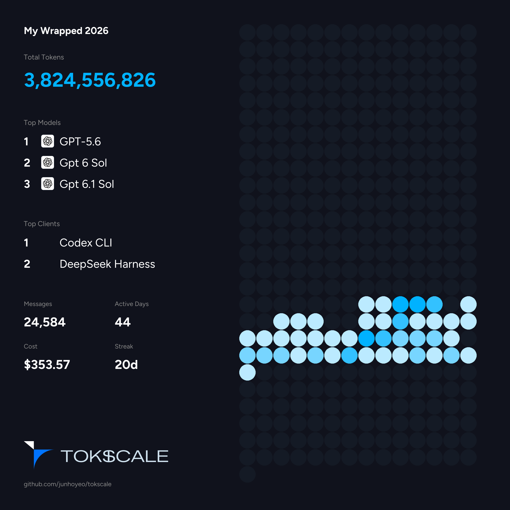
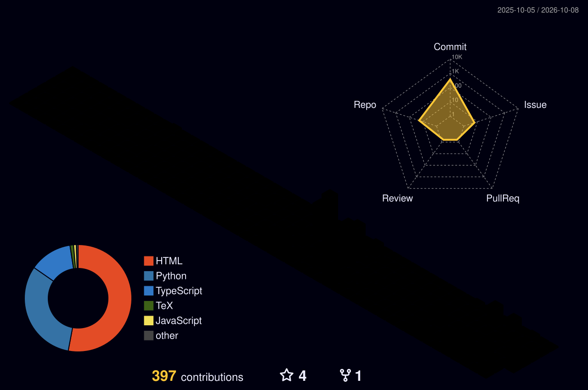

<!-- 顶部打字动画 - 全宽居中 -->
<div align="center">
  <a href="https://git.io/typing-svg">
    
  </a>
</div>

<p align="center">
  <a href="https://space.bilibili.com/481036572"></a>&nbsp;&nbsp;
  <a href="https://www.xiaohongshu.com/user/profile/5e72db210000000001000d66"></a>&nbsp;&nbsp;
  &nbsp;&nbsp;
  <a href="https://wakatime.com/@SakuraLoveForever"></a>&nbsp;&nbsp;
  <a href="https://codeforces.com/profile/Sakura_Love">
    
  </a>&nbsp;&nbsp;
  <a href="https://www.luogu.com.cn/user/233253">
    
  </a>
</p>

<div align="center">
  <picture>
    <source media="(prefers-color-scheme: dark)" srcset="https://raw.githubusercontent.com/SakuraLoveForever/SakuraLoveForever/refs/heads/output/github-contribution-grid-snake-dark.svg">
    <source media="(prefers-color-scheme: light)" srcset="https://raw.githubusercontent.com/SakuraLoveForever/SakuraLoveForever/refs/heads/output/github-contribution-grid-snake.svg">
    
  </picture>
</div>

<p align="center">
  &nbsp;
  &nbsp;
  <br>
  &nbsp;
  &nbsp;
  <br>
</p>

<details>
<summary>Tokscale 原生 token 可视化</summary>

<div align="center">
  
</div>

</details>

<p align="center">本机现存日志 · 每天北京时间 08:30 自动同步 · 图中费用为 API 等价估算，不代表实际扣费<br>
会话时长按会话累计，可能包含并行重叠；历史区间不代表真实开始使用日期<br>
<a href="docs/profile-statistics.md">数据覆盖范围、统计口径与自动同步说明</a></p>

<!--START_SECTION:waka-->
**🐱 My GitHub Data** 

> 📦 813.6 kB Used in GitHub's Storage 
 > 
> 🏆 421 Contributions in the Year 2026
 > 
> 🚫 Not Opted to Hire
 > 
> 📜 22 Public Repositories 
 > 
> 🔑 0 Private Repositories 
 > 
**I'm a Night 🦉** 

```text
🌞 Morning                38 commits          ⬛⬛⬜⬜⬜⬜⬜⬜⬜⬜⬜⬜⬜⬜⬜⬜⬜⬜⬜⬜⬜⬜⬜⬜⬜   09.29 % 
🌆 Daytime                110 commits         ⬛⬛⬛⬛⬛⬛⬛⬜⬜⬜⬜⬜⬜⬜⬜⬜⬜⬜⬜⬜⬜⬜⬜⬜⬜   26.89 % 
🌃 Evening                140 commits         ⬛⬛⬛⬛⬛⬛⬛⬛⬛⬜⬜⬜⬜⬜⬜⬜⬜⬜⬜⬜⬜⬜⬜⬜⬜   34.23 % 
🌙 Night                  121 commits         ⬛⬛⬛⬛⬛⬛⬛⬜⬜⬜⬜⬜⬜⬜⬜⬜⬜⬜⬜⬜⬜⬜⬜⬜⬜   29.58 % 
```
📅 **I'm Most Productive on Tuesday** 

```text
Monday                   61 commits          ⬛⬛⬛⬛⬜⬜⬜⬜⬜⬜⬜⬜⬜⬜⬜⬜⬜⬜⬜⬜⬜⬜⬜⬜⬜   14.91 % 
Tuesday                  92 commits          ⬛⬛⬛⬛⬛⬛⬜⬜⬜⬜⬜⬜⬜⬜⬜⬜⬜⬜⬜⬜⬜⬜⬜⬜⬜   22.49 % 
Wednesday                46 commits          ⬛⬛⬛⬜⬜⬜⬜⬜⬜⬜⬜⬜⬜⬜⬜⬜⬜⬜⬜⬜⬜⬜⬜⬜⬜   11.25 % 
Thursday                 50 commits          ⬛⬛⬛⬜⬜⬜⬜⬜⬜⬜⬜⬜⬜⬜⬜⬜⬜⬜⬜⬜⬜⬜⬜⬜⬜   12.22 % 
Friday                   57 commits          ⬛⬛⬛⬜⬜⬜⬜⬜⬜⬜⬜⬜⬜⬜⬜⬜⬜⬜⬜⬜⬜⬜⬜⬜⬜   13.94 % 
Saturday                 80 commits          ⬛⬛⬛⬛⬛⬜⬜⬜⬜⬜⬜⬜⬜⬜⬜⬜⬜⬜⬜⬜⬜⬜⬜⬜⬜   19.56 % 
Sunday                   23 commits          ⬛⬜⬜⬜⬜⬜⬜⬜⬜⬜⬜⬜⬜⬜⬜⬜⬜⬜⬜⬜⬜⬜⬜⬜⬜   05.62 % 
```


📊 **This Week I Spent My Time On** 

```text
🕑︎ Time Zone: Asia/Shanghai

💬 Programming Languages: 
Python                   6 hrs 54 mins       ⬛⬛⬛⬛⬛⬛⬛⬛⬛⬛⬛⬛⬛⬛⬛⬛⬛⬛⬛⬜⬜⬜⬜⬜⬜   76.30 % 
Markdown                 1 hr 4 mins         ⬛⬛⬛⬜⬜⬜⬜⬜⬜⬜⬜⬜⬜⬜⬜⬜⬜⬜⬜⬜⬜⬜⬜⬜⬜   11.85 % 
Other                    58 mins             ⬛⬛⬛⬜⬜⬜⬜⬜⬜⬜⬜⬜⬜⬜⬜⬜⬜⬜⬜⬜⬜⬜⬜⬜⬜   10.78 % 
YAML                     2 mins              ⬜⬜⬜⬜⬜⬜⬜⬜⬜⬜⬜⬜⬜⬜⬜⬜⬜⬜⬜⬜⬜⬜⬜⬜⬜   00.37 % 
Git Config               1 min               ⬜⬜⬜⬜⬜⬜⬜⬜⬜⬜⬜⬜⬜⬜⬜⬜⬜⬜⬜⬜⬜⬜⬜⬜⬜   00.31 % 

🔥 Editors: 
Codex Vscode             9 hrs 2 mins        ⬛⬛⬛⬛⬛⬛⬛⬛⬛⬛⬛⬛⬛⬛⬛⬛⬛⬛⬛⬛⬛⬛⬛⬛⬛   99.88 % 
Codex CLI                0 secs              ⬜⬜⬜⬜⬜⬜⬜⬜⬜⬜⬜⬜⬜⬜⬜⬜⬜⬜⬜⬜⬜⬜⬜⬜⬜   00.12 % 

🐱‍💻 Projects: 
Macro                    8 hrs 23 mins       ⬛⬛⬛⬛⬛⬛⬛⬛⬛⬛⬛⬛⬛⬛⬛⬛⬛⬛⬛⬛⬛⬛⬛⬜⬜   92.70 % 
scripts                  18 mins             ⬛⬜⬜⬜⬜⬜⬜⬜⬜⬜⬜⬜⬜⬜⬜⬜⬜⬜⬜⬜⬜⬜⬜⬜⬜   03.44 % 
SakuraLoveForever        17 mins             ⬛⬜⬜⬜⬜⬜⬜⬜⬜⬜⬜⬜⬜⬜⬜⬜⬜⬜⬜⬜⬜⬜⬜⬜⬜   03.21 % 
None                     2 mins              ⬜⬜⬜⬜⬜⬜⬜⬜⬜⬜⬜⬜⬜⬜⬜⬜⬜⬜⬜⬜⬜⬜⬜⬜⬜   00.53 % 
Anime                    0 secs              ⬜⬜⬜⬜⬜⬜⬜⬜⬜⬜⬜⬜⬜⬜⬜⬜⬜⬜⬜⬜⬜⬜⬜⬜⬜   00.12 % 

💻 Operating System: 
Windows                  9 hrs 3 mins        ⬛⬛⬛⬛⬛⬛⬛⬛⬛⬛⬛⬛⬛⬛⬛⬛⬛⬛⬛⬛⬛⬛⬛⬛⬛   100.00 % 
```

**I Mostly Code in Python** 

```text
Python                   8 repos             ⬛⬛⬛⬛⬛⬛⬛⬛⬛⬛⬜⬜⬜⬜⬜⬜⬜⬜⬜⬜⬜⬜⬜⬜⬜   38.10 % 
HTML                     6 repos             ⬛⬛⬛⬛⬛⬛⬛⬜⬜⬜⬜⬜⬜⬜⬜⬜⬜⬜⬜⬜⬜⬜⬜⬜⬜   28.57 % 
Kotlin                   1 repo              ⬛⬜⬜⬜⬜⬜⬜⬜⬜⬜⬜⬜⬜⬜⬜⬜⬜⬜⬜⬜⬜⬜⬜⬜⬜   04.76 % 
C                        1 repo              ⬛⬜⬜⬜⬜⬜⬜⬜⬜⬜⬜⬜⬜⬜⬜⬜⬜⬜⬜⬜⬜⬜⬜⬜⬜   04.76 % 
TeX                      1 repo              ⬛⬜⬜⬜⬜⬜⬜⬜⬜⬜⬜⬜⬜⬜⬜⬜⬜⬜⬜⬜⬜⬜⬜⬜⬜   04.76 % 
```


 Last Updated on 09/10/2026 22:46:37 UTC
<!--END_SECTION:waka-->

<!-- 空行分隔 -->
<div>&nbsp;</div>

<div align="center">
  
</div>

<div align="center">
  <table>
    <tr>
      <td align="center">
        <a href="https://github.com/anuraghazra/github-readme-stats">
          
        </a>
      </a>
      <td align="center">
        <a href="https://git.io/streak-stats">
          
        </a>
      </a>
    </tr>
    <tr>
      <td align="center" width="50%">
        <a href="https://github.com/anuraghazra/github-readme-stats">
          
        </a>
      </a>
      <td align="center" width="50%">
        
      </a>
    </tr>
  </table>
</div>

<div>&nbsp;</div>

<div align="center">
  <a href="https://github.com/lowlighter/metrics">
    
  </a>
</div>

<div>&nbsp;</div>

<div align="center">
  <table>
    <!-- 第 1 行（原第 3 行）：Issues/PRs 和 Reactions -->
    <tr>
      <td align="center">
        
      </td>
      <td align="center">
        
      </td>
    </tr>
    <!-- 第 2 行：语言统计 和 Star 仓库 -->
    <tr>
      <td align="center">
        
      </td>
      <td align="center">
        
      </td>
    </tr>
    <!-- 第 3 行（原第 1 行）：日历类 -->
    <tr>
      <td align="center">
        
      </td>
      <td align="center">
        
      </td>
    </tr>
  </table>
</div>

<div align="center">
  
</div>
